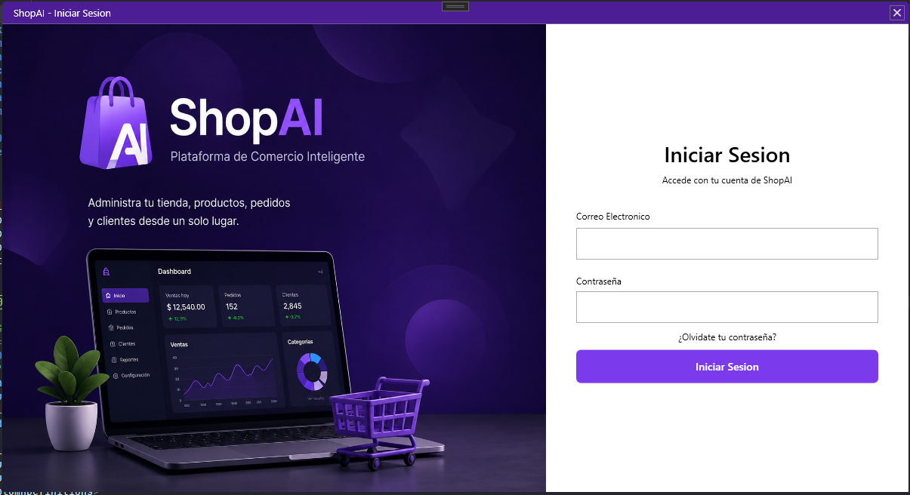
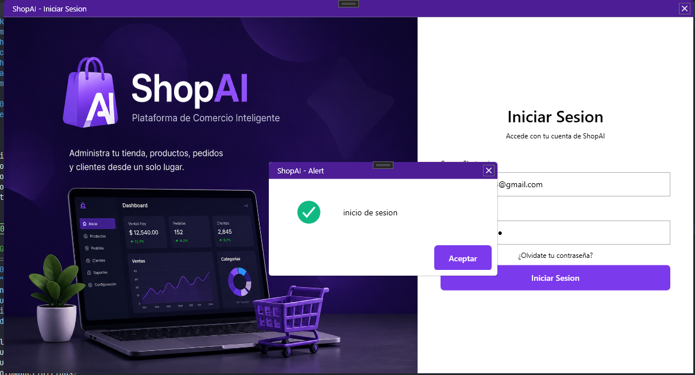
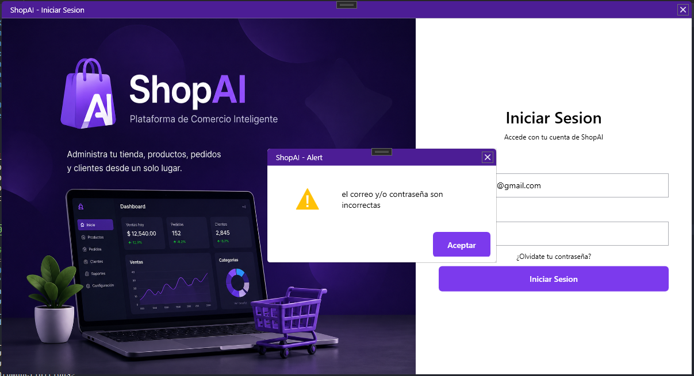
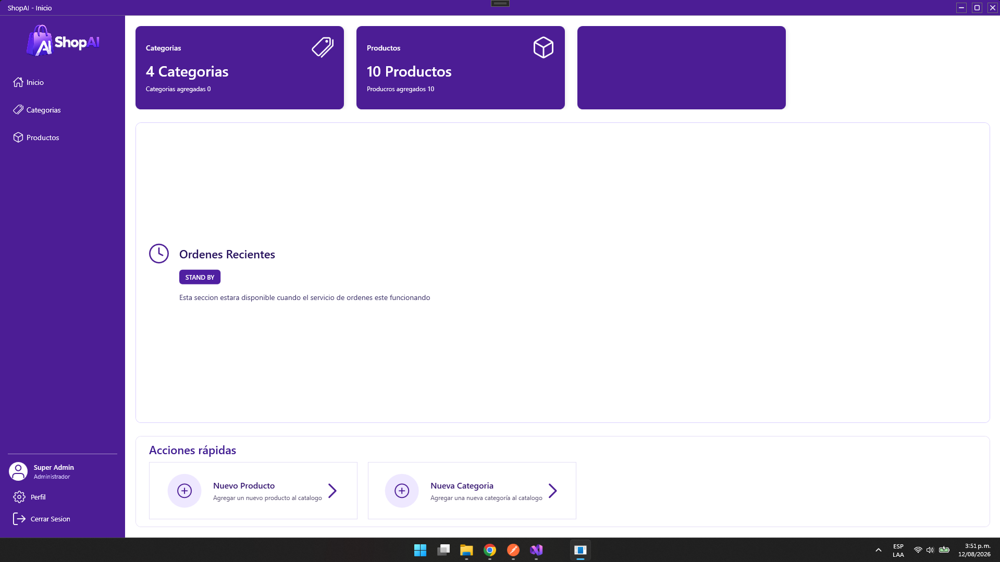
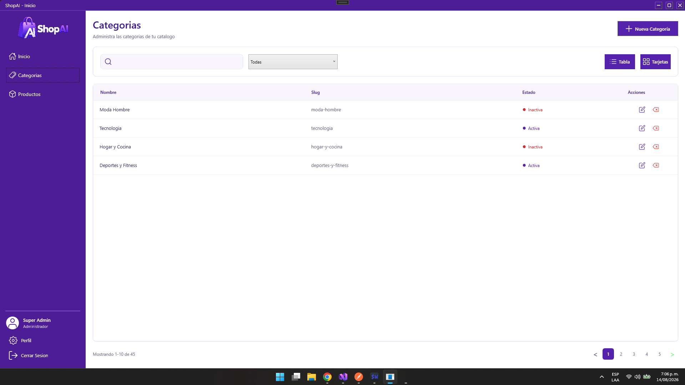
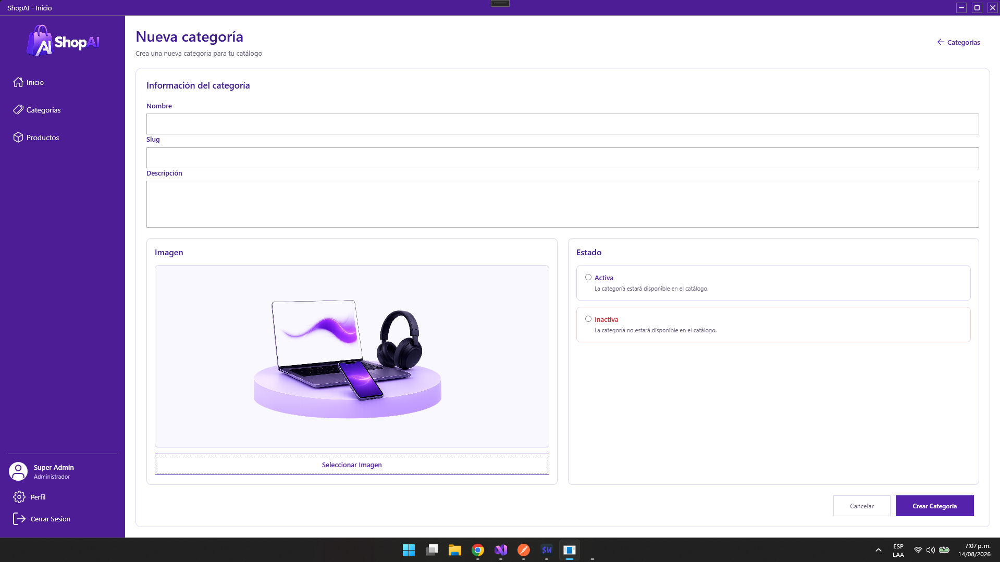

# ShopAIDesktop

Aplicación de escritorio administrativa de **ShopAI**, desarrollada con **C#**, **.NET 10** y **WPF**.

ShopAIDesktop está orientada a la administración de la plataforma ShopAI y consume los servicios backend a través del **API Gateway**.

---

## Tecnologías

- C#
- .NET 10
- WPF
- XAML
- REST API
- Dependency Injection
- HttpClient
- SharpVectors

---

## Interfaz

La aplicación cuenta con una interfaz personalizada para el área administrativa de ShopAI.

### Login



Pantalla de autenticación utilizada para acceder al panel administrativo de ShopAI.

### Login exitoso



Después de validar correctamente las credenciales, la aplicación muestra una alerta de éxito y permite continuar hacia el panel administrativo.

### Login con advertencia



La interfaz también utiliza alertas de advertencia para informar al usuario cuando una operación de autenticación no puede completarse.

---

## Dashboard



El Dashboard presenta una vista general de la información administrativa de ShopAI mediante tarjetas de resumen, accesos rápidos y secciones organizadas para futuras funcionalidades.

---

## Categorías



La sección de categorías permite consultar y administrar la información del catálogo mediante una interfaz que incluye búsqueda, filtros, acciones y listado de registros.

---

## Formulario de creación de categoría



El formulario permite registrar una nueva categoría del catálogo mediante una interfaz que incluye información básica, descripción, estado y selección de imagen.

---

## Componentes de interfaz

ShopAIDesktop utiliza componentes reutilizables para mantener una interfaz consistente entre los diferentes módulos.

Entre ellos se encuentran:

- `Sidebar`
- `CustomCard`
- `CustomAlert`
- `WindowTitleBar`

Estos componentes permiten reutilizar elementos visuales y mantener centralizada parte de la presentación de la aplicación.

---

## Arquitectura

La aplicación utiliza una estructura separada por responsabilidades:

```text
ShopAIDesktop/
│
├── Assets/
│   ├── Icons/
│   └── Images/
│
├── Src/
│   ├── Domain/
│   │   ├── Common/
│   │   ├── Dtos/
│   │   ├── Services/
│   │   └── entities/
│   │
│   └── Infraestructure/
│       ├── Services/
│       └── Sessions/
│
├── Styles/
│
├── UI/
│   ├── Components/
│   ├── Dashboard/
│   └── Pages/
│
├── docs/
│   └── images/
│
├── App.xaml
├── MainWindow.xaml
└── ShopAIDesktop.csproj
```

### Domain

Contiene los modelos, DTOs y contratos utilizados por la aplicación.

### Infrastructure

Contiene las implementaciones de los servicios HTTP y la gestión de sesión.

### UI

Contiene las páginas y componentes visuales de WPF.

### Assets

Contiene los recursos utilizados por la aplicación, como:

- Logo.
- Imágenes.
- Iconos SVG.

### docs

Contiene las capturas utilizadas exclusivamente para documentar la interfaz del proyecto.

---

## Integración con ShopAI

ShopAIDesktop se comunica con la plataforma mediante el API Gateway:

```text
┌──────────────────────┐
│    ShopAIDesktop     │
│      WPF / .NET      │
└──────────┬───────────┘
           │
           │ HTTP / REST
           ▼
┌──────────────────────┐
│     API Gateway      │
│        :3000         │
└──────────┬───────────┘
           │
      ┌────┴────┐
      │         │
      ▼         ▼
┌──────────┐ ┌──────────┐
│ Identity │ │ Catalog  │
│  :3001   │ │  :3002   │
└──────────┘ └──────────┘
```

La aplicación utiliza el Gateway como punto de entrada para las operaciones disponibles desde el cliente administrativo.

---

## Ejecución

### Requisitos

- Windows
- .NET 10 SDK
- API Gateway de ShopAI ejecutándose localmente

Comprobar la versión instalada:

```powershell
dotnet --version
```

### Restaurar dependencias

```powershell
dotnet restore
```

### Ejecutar

```powershell
dotnet run
```

También puede ejecutarse directamente desde Visual Studio.

---

## Estado del proyecto

Actualmente ShopAIDesktop cuenta con:

- Login.
- Autenticación con Identity.
- Gestión de sesión.
- Dashboard.
- Visualización de información del catálogo.
- Interfaz de categorías.
- Sidebar administrativo.
- Componentes reutilizables.
- Alertas de éxito y advertencia.
- Iconos SVG.
- Estilos personalizados para WPF.

El proyecto continuará evolucionando junto con los diferentes módulos administrativos de ShopAI.

---

## ShopAI

**ShopAIDesktop** forma parte de **ShopAI**, una plataforma de comercio electrónico basada en arquitectura de microservicios.
